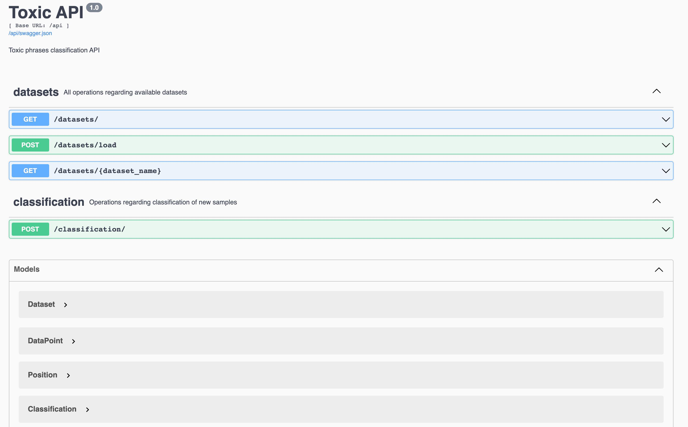
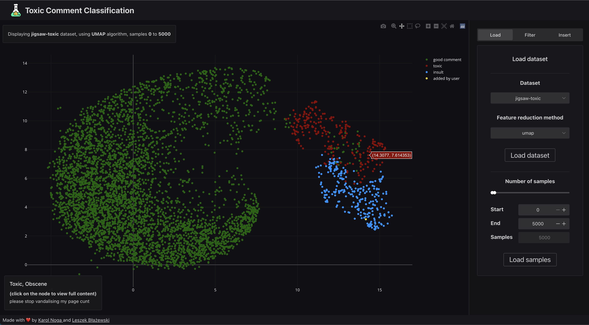
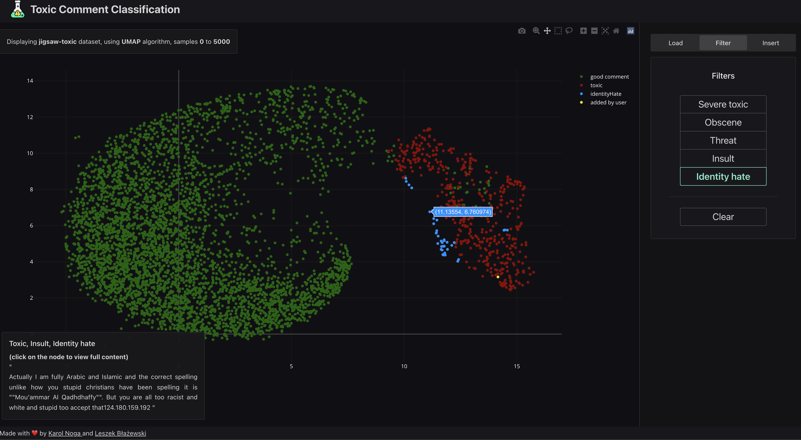
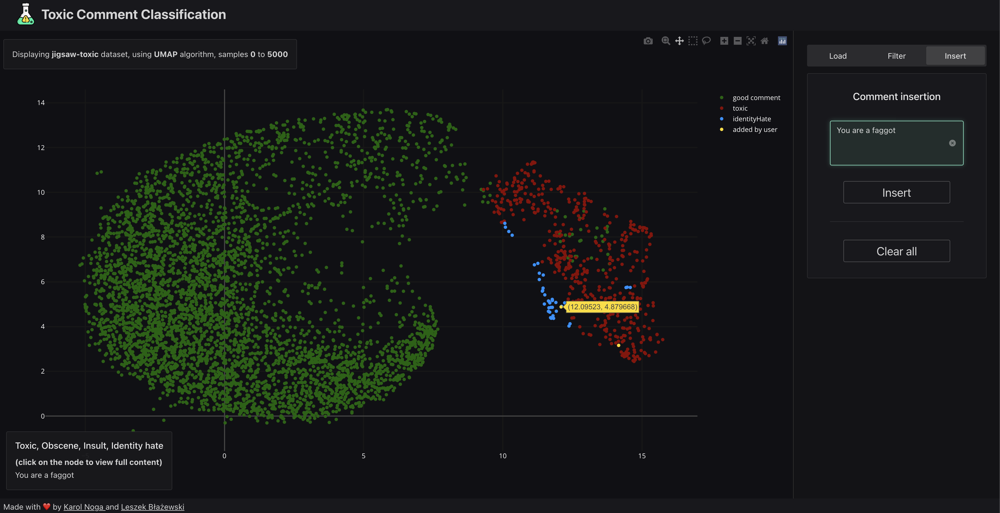

# Toxic text big data visualisations

Big data visualizations - multiclassification of 6 types of toxicity: ['toxic', 'severe_toxic', 'obscene', 'threat', 'insult', 'identity_hate'].

Based on [Toxic Comment Classifier](https://developer.ibm.com/exchanges/models/all/max-toxic-comment-classifier/) which includes pretrained BERT model for [Kaggle Toxic Comment Classification Challenge](https://www.kaggle.com/c/jigsaw-toxic-comment-classification-challenge/data). 

The pretrained BERT PyTorch model was used on 2 datasets: 

* [jigsaw-toxic](https://www.kaggle.com/c/jigsaw-toxic-comment-classification-challenge/data) (training dataset)
* [polytical-tweets](https://www.kaggle.com/kaushiksuresh147/political-tweets)

where outputs of last hidden layer were extracted and fed as learning datasets into two dimension reduction models: PCA and UMAP. As a next step, we visualized all the reduced data to check how well the model grouped similar toxic sentences together. Later, the acquired results were converted to JSON and were saved along with the corresponding trained models as pickle files. As the last step, all the files were loaded inside a docker container and wrapped with an easy-to-access REST API which allows querying the data and classifying new toxic phrases with the pretrained models.

The process of data extraction, pretrained model usage, training PCA/UMAP and visualizing the results can be found in the [Jupyter notebook](./big_data.ipynb)

## Screenshots









## Used technologies

1. PyTorch - pretrained model + all ML related operations
2. Flask-RESTX - backend api for allowing REST operations on the created models/datasets
3. Plotly.js - visualising the datasets in browser
4. Vue - for creating the SPA frontend part
5. Docker - easy to run anywhere containers

Below you can find the details how to access the application.

## Docker INFO

All the loaded models/datasets are really memory hungry, so be sure to give your docker resources around 13 GB if you plan to load all of the datasets.

## How to start the project

### DEV MODE

```bash
docker-compose up
```

Access the frontend on http://localhost:8080
Access the backend (swagger) on http://localhost:8081/api/

For easier backend development, when rebuilding docker image often, it would be wise to use pip cache since the modules weight much. Do the following:

Change the line with pip install in `Dockerfile` to:

```Dockerfile
RUN --mount=type=cache,target=/root/.cache/pip pip install -r requirements.txt
```

```bash
docker-compose up
```

If the command fails, it might be necessary to:

1. Add the line `# syntax = docker/dockerfile:experimental` as first line in Dockerfile
2. Run `export DOCKER_BUILDKIT=1` before issuing `docker-compose up`


### PROD MODE

```bash
docker-compose -f docker-compose.prod.yml up
```

Optimized for deployment, uses nginx as reverse proxy, gunicorn to run the api and does not require docker volumes.

Access the frontend on http://localhost:8080
Access the backend from Vue on http://localhost:8080/api (swagger not exposed)
